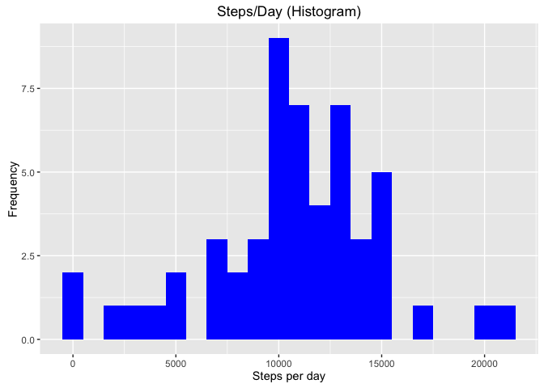
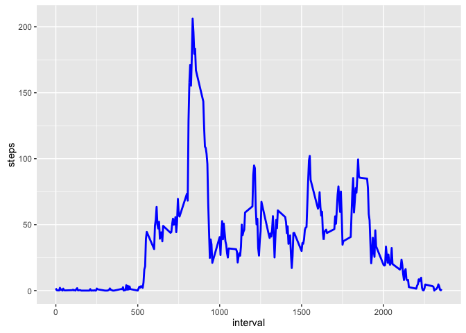
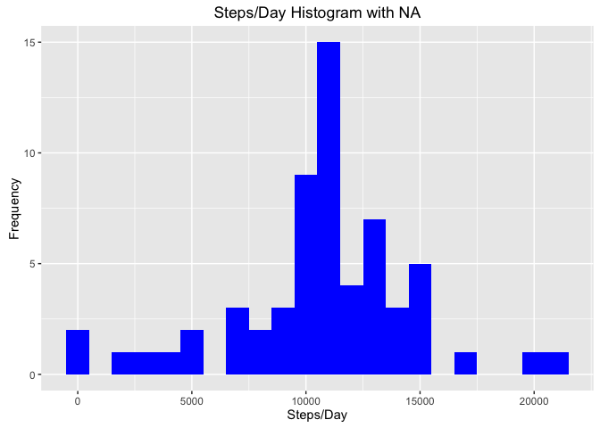
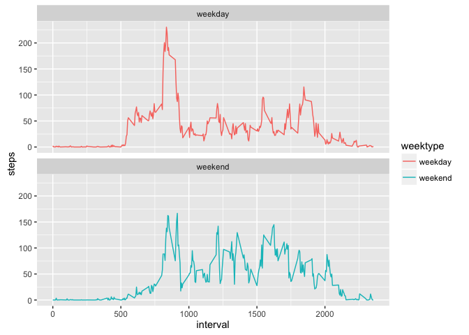

Introduction
------------

It is now possible to collect a large amount of data about personal
movement using activity monitoring devices such as a Fitbit, Nike
Fuelband, or Jawbone Up. These type of devices are part of the
“quantified self” movement – a group of enthusiasts who take
measurements about themselves regularly to improve their health, to find
patterns in their behavior, or because they are tech geeks. But these
data remain under-utilized both because the raw data are hard to obtain
and there is a lack of statistical methods and software for processing
and interpreting the data.

This assignment makes use of data from a personal activity monitoring
device. This device collects data at 5 minute intervals through out the
day. The data consists of two months of data from an anonymous
individual collected during the months of October and November, 2012 and
include the number of steps taken in 5 minute intervals each day.

The data for this assignment can be downloaded from the course web site:

Dataset: [Activity monitoring
data](https://d396qusza40orc.cloudfront.net/repdata%2Fdata%2Factivity.zip)
\[52K\]

The variables included in this dataset are:

-   steps: Number of steps taking in a 5-minute interval (missing values
    are coded as NA)
-   date: The date on which the measurement was taken in YYYY-MM-DD
    format
-   interval: Identifier for the 5-minute interval in which measurement
    was taken

The dataset is stored in a comma-separated-value (CSV) file and there
are a total of 17,568 observations in this dataset.

    library(dplyr)
    library(lubridate)
    library(ggplot2)
    library(broman)

Loading and preprocessing the data
----------------------------------

Show any code that is needed to:

1.  Load the data (i.e. `read.csv()`)
2.  Process/transform the data (if necessary) into a format suitable for
    your analysis

Steps required:

1.  Unzip the zip file and make sure `activity.csv` is in the
    working directory.

<!-- -->

    activity <- read.csv("activity.csv", header = TRUE,colClasses = c("numeric", "character","integer"))

1.  Tidying the data

<!-- -->

    activity$date <- ymd(activity$date)

1.  Summary the data by using `str()`, `summary()` and `head()`

<!-- -->

    str(activity)

    ## 'data.frame':    17568 obs. of  3 variables:
    ##  $ steps   : num  NA NA NA NA NA NA NA NA NA NA ...
    ##  $ date    : Date, format: "2012-10-01" "2012-10-01" ...
    ##  $ interval: int  0 5 10 15 20 25 30 35 40 45 ...

    summary(activity)

    ##      steps             date               interval     
    ##  Min.   :  0.00   Min.   :2012-10-01   Min.   :   0.0  
    ##  1st Qu.:  0.00   1st Qu.:2012-10-16   1st Qu.: 588.8  
    ##  Median :  0.00   Median :2012-10-31   Median :1177.5  
    ##  Mean   : 37.38   Mean   :2012-10-31   Mean   :1177.5  
    ##  3rd Qu.: 12.00   3rd Qu.:2012-11-15   3rd Qu.:1766.2  
    ##  Max.   :806.00   Max.   :2012-11-30   Max.   :2355.0  
    ##  NA's   :2304

    head(activity)

    ##   steps       date interval
    ## 1    NA 2012-10-01        0
    ## 2    NA 2012-10-01        5
    ## 3    NA 2012-10-01       10
    ## 4    NA 2012-10-01       15
    ## 5    NA 2012-10-01       20
    ## 6    NA 2012-10-01       25

What is mean total number of steps taken per day?
-------------------------------------------------

For this part of the assignment the missing values can be ignored.

1.  Calculate the total number of steps taken per day.

<!-- -->

    steps <- activity %>%
      filter(!is.na(steps)) %>%
      group_by(date) %>%
      summarize(steps = sum(steps)) %>%
      print

    ## # A tibble: 53 x 2
    ##          date steps
    ##        <date> <dbl>
    ## 1  2012-10-02   126
    ## 2  2012-10-03 11352
    ## 3  2012-10-04 12116
    ## 4  2012-10-05 13294
    ## 5  2012-10-06 15420
    ## 6  2012-10-07 11015
    ## 7  2012-10-09 12811
    ## 8  2012-10-10  9900
    ## 9  2012-10-11 10304
    ## 10 2012-10-12 17382
    ## # ... with 43 more rows

1.  If you do not understand the difference between a histogram and a
    barplot, research the difference between them. Make a histogram of
    the total number of steps taken each day

<!-- -->

    ggplot(steps, aes(x = steps)) +
      geom_histogram(fill = "blue", binwidth = 1000) +
      labs(title = "Steps/Day (Histogram)", x = "Steps per day", y = "Frequency")

1.  Calculate and report the mean and median of the total number of
    steps taken per day

<!-- -->

    mean_steps <- mean(steps$steps, na.rm = TRUE)
    mean_steps 

    ## [1] 10766.19

    median_steps <- median(steps$steps, na.rm = TRUE)
    median_steps 

    ## [1] 10765

-   Mean steps:10766.19
-   Median steps are :10765.

What is the average daily activity pattern?
-------------------------------------------

1.  Make a time series plot (i.e. 𝚝𝚢𝚙𝚎 = "𝚕") of the 5-minute
    interval (x-axis) and the average number of steps taken, averaged
    across all days (y-axis)

Calculate the average number of steps taken in each 5-minute interval
per day and group them by `interval`:

    interval <- activity %>%
      filter(!is.na(steps)) %>%
      group_by(interval) %>%
      summarize(steps = mean(steps))
      head(interval)

    ## # A tibble: 6 x 2
    ##   interval     steps
    ##      <int>     <dbl>
    ## 1        0 1.7169811
    ## 2        5 0.3396226
    ## 3       10 0.1320755
    ## 4       15 0.1509434
    ## 5       20 0.0754717
    ## 6       25 2.0943396

Time series of the 5-minute interval and average steps taken plot

    ggplot(interval, aes(x=interval, y=steps)) +
      geom_line(color = "blue", size=1)

1.  Which 5-minute interval, on average across all the days in the
    dataset, contains the maximum number of steps?

<!-- -->

    intervalstep <- interval[which.max(interval$steps),]
    intervalstep

    ## # A tibble: 1 x 2
    ##   interval    steps
    ##      <int>    <dbl>
    ## 1      835 206.1698

The interval 835 with approx 206 steps.

Imputing missing values
-----------------------

Note that there are a number of days/intervals where there are missing
values (coded as 𝙽𝙰). The presence of missing days may introduce bias
into some calculations or summaries of the data.

1.  Calculate and report the total number of missing values in the
    dataset (i.e. the total number of rows with 𝙽𝙰s)

<!-- -->

    sum(is.na(activity$steps))

    ## [1] 2304

1.  Devise a strategy for filling in all of the missing values in
    the dataset. The strategy does not need to be sophisticated. For
    example, you could use the mean/median for that day, or the mean for
    that 5-minute interval, etc.

2.  Create a new dataset that is equal to the original dataset but with
    the missing data filled in.

<!-- -->

    activity_noNA <- activity
    nas <- is.na(activity_noNA$steps)
    avg_interval <- tapply(activity_noNA$steps, activity_noNA$interval, mean, na.rm=TRUE, simplify=TRUE)
    activity_noNA$steps[nas] <- avg_interval[as.character(activity_noNA$interval[nas])]

1.  Make a histogram of the total number of steps taken each day and
    Calculate and report the mean and median total number of steps taken
    per day. Do these values differ from the estimates from the first
    part of the assignment? What is the impact of imputing missing data
    on the estimates of the total daily number of steps?

<!-- -->

    steps_full <- activity_noNA %>%
      filter(!is.na(steps)) %>%
      group_by(date) %>%
      summarize(steps = sum(steps)) %>%
      print

    ## # A tibble: 61 x 2
    ##          date    steps
    ##        <date>    <dbl>
    ## 1  2012-10-01 10766.19
    ## 2  2012-10-02   126.00
    ## 3  2012-10-03 11352.00
    ## 4  2012-10-04 12116.00
    ## 5  2012-10-05 13294.00
    ## 6  2012-10-06 15420.00
    ## 7  2012-10-07 11015.00
    ## 8  2012-10-08 10766.19
    ## 9  2012-10-09 12811.00
    ## 10 2012-10-10  9900.00
    ## # ... with 51 more rows

    ggplot(steps_full, aes(x = steps)) +
      geom_histogram(fill = "blue", binwidth = 1000) +
      labs(title = "Steps/Day Histogram with NA", x = "Steps/Day", y = "Frequency")

    mean_steps_full <- mean(steps_full$steps, na.rm = TRUE)
    mean_steps_full

    ## [1] 10766.19

    median_steps_full <- median(steps_full$steps, na.rm = TRUE)
    median_steps_full

    ## [1] 10766.19

The impact is that both the mean and median are equal: 10766.19

Are there differences in activity patterns between weekdays and weekends?
-------------------------------------------------------------------------

For this part the 𝚠𝚎𝚎𝚔𝚍𝚊𝚢𝚜() function may be of some help here. Use the
dataset with the filled-in missing values for this part.

1.  Create a new factor variable in the dataset with two levels –
    “weekday” and “weekend” indicating whether a given date is a weekday
    or weekend day.

<!-- -->

    activity_noNA <- mutate(activity_noNA, weektype = ifelse(weekdays(activity_noNA$date) == "Saturday" | weekdays(activity_noNA$date) == "Sunday", "weekend", "weekday"))
    activity_noNA$weektype <- as.factor(activity_noNA$weektype)
    head(activity_noNA)

    ##       steps       date interval weektype
    ## 1 1.7169811 2012-10-01        0  weekday
    ## 2 0.3396226 2012-10-01        5  weekday
    ## 3 0.1320755 2012-10-01       10  weekday
    ## 4 0.1509434 2012-10-01       15  weekday
    ## 5 0.0754717 2012-10-01       20  weekday
    ## 6 2.0943396 2012-10-01       25  weekday

1.  Make a panel plot containing a time series plot (i.e. 𝚝𝚢𝚙𝚎 = "𝚕") of
    the 5-minute interval (x-axis) and the average number of steps
    taken, averaged across all weekday days or weekend days (y-axis).
    See the README file in the GitHub repository to see an example of
    what this plot should look like using simulated data.

<!-- -->

    interval_full <- activity_noNA %>%
      group_by(interval, weektype) %>%
      summarise(steps = mean(steps))
    s <- ggplot(interval_full, aes(x=interval, y=steps, color = weektype)) +
      geom_line() +
      facet_wrap(~weektype, ncol = 1, nrow=2)
    print(s)

DONE !
------
